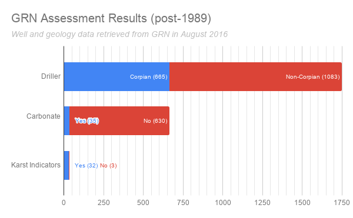

================================================
1. Mining Data From WI WCRs (for wells pre-1989)
================================================

`Citizen Engagement Event #1 - Aug. 8th, 2016`

Background
==========

Any time a new well is drilled, a detailed geological log is made, recording the depth and composition of each sedimentary layer that is encountered on the way down. This information is recorded in a Well Construction Report (WCR) which is then submitted to the state. After examining many of these drill logs, the CSP determined it would be possible to detect evidence of karstic activity in the well by looking for specific geologic layers and terminology.

In the state of Wisconsin, all post-1989 well-drilling and sample records are stored in a publicly accessible database, called the `Groundwater Retrieval Network <https://dnr.wi.gov/topic/Groundwater/grn.html>`_. Therefore, finding evidence of karst activity in post-1989 wells was undertaken as a data download and algorithmic analysis.

However, to evaluate wells that were drilled prior to 1989, we had to turn to scanned images of historic WCRs. These WCRs exist as PDF files maintained by the `Wisconsin Geological & Natural History Survey <https://wgnhs.wisc.edu>`_ (WGNHS). We requested all of the historic WCRs for Crawford County, and received `1,136 PDFs <http://ftp.legiongis.com/wcr-crawford>`_.

Methodology
===========

After a cursory examination of the WCR documents, the CSP team devised a methodology to simplify the process of determining whether a drill log revealed any karst characteristics in the well.

To utilize CSP's large volunteer network, Legion GIS created a web-based user interface that allowed volunteers to examine the image of a WCR while answering questions on an embedded Google Form. The `original user interface <csp/list-wcrs.html>`_ is still available for viewing, or see the screenshot below. In this way, any number of volunteers could participate in the effort from any computer with internet access, and their data collection efforts were recorded in a single Google spreadsheet.

Volunteers were provided with `this methodology handout <_static/files/AssessmentCriteriaforKarsticWells-4.pdf>`_ instructed to follow this decision-based methodology:

**1. Check Well Driller**

First, respondents were asked to determine whether the well was drilled by Corpian Well Drilling. Based on prior experience with the high quality of Corpian's drill logs, we determined that only wells drilled by this company would be analyzed in the survey. 

*If the well was not drilled by Corpian, the volunteer was prompted to submit the Google Form without answering any further questions and move on to the next one.*

**2. Check for Carbonate Bedrock**

Next, respondents were asked to look for signs of carbonate geology within the well drill log. Any mention of “limestone”, “lime rock”/“limerock”, or “dolomite”/“dolostone” was recorded as evidence of carbonate geology.

*If there was no evidence of carbonate geology in the well, the volunteer was prompted to submit the Google Form without answering any further questions and move on to the next one.*

**3. Check for Karst Activity**

Next, respondents were asked to look for signs of karst activity within the drill log. They instructed to look for any of the following terminology:

* "Limestone & crevice(s)”, “lime rock & crevice(s)"
* "Broken limestone", “fractured limestone”
* "Cave", "void"
* "Sand pocket", “mud pocket”, “mudhole”
* "Mud & clay" (if found between rock layers)

*If there was no evidence of karst activity in the well, the volunteer was prompted to submit the Google Form without answering any further questions and move on to the next one.*

**4. Record Drill Log Geology**

Finally, if karst activity was encountered in the drill log, the volunteers were instructed to depth of each geologic layer, as well as its reported material.

Results
=======

On the evening of August 8th, 2016, approximately 20 volunteers met for two hours, split between the Valley Stewardship Network office in downtown Viroqua and the Viroqua Public Library on block away. Introductions were made, volunteers were given an overview of the project, and by the end of the night 886 of 1,136 WCRs (78%) had been analyzed, leaving only 250 unfinished. The following day, some volunteers continued to work through the online interface from home and finished the entire set of Crawford County WCRs.

The full summary of results can be seen above. Of the 1,136 WCRs, 440 were recorded by a driller other than Corpian, so we did not seek further assessment on these wells. Of the remaining 696 WCRs that were recorded by Corpian, 391 had carbonate characteristics, and of these, 108 had karst indicators in the drill log. You can also access the raw Google Form responses `here <https://docs.google.com/spreadsheets/d/1RdV2OxA6jlCYrHaBD7waGpBJ2_SxZtZP8-NHfOKZe3U/edit?usp=sharing>`_.

We also scripted the extraction of the same data for all WCRs from after 1989, and the results are shown below. The markedly lower proportion of carbonate geology in this set of WCRs may be due to a systematic failure to find the correct terminology, and ultimately deserve more research.

Reflections
===========

Overall, this activity was a great success. The web interface was easy for people to follow, and the only hang-up in the very beginning was an overload on the VSN office's wireless network. However, once the group split and half went to the Viroqua Public Library there were no more connectivity problems. We were very pleased with the amount of work that was accomplished in a short time.